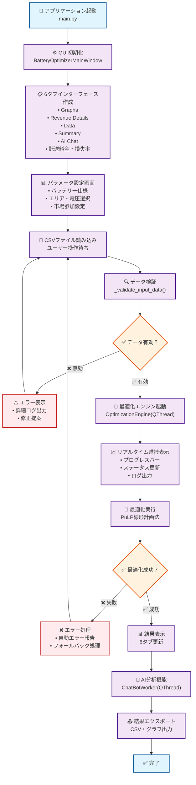
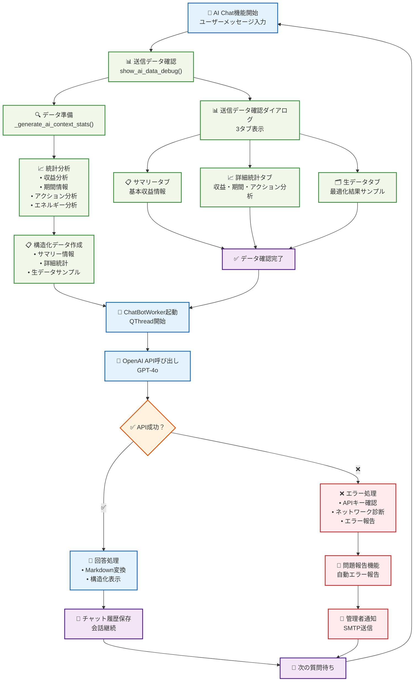
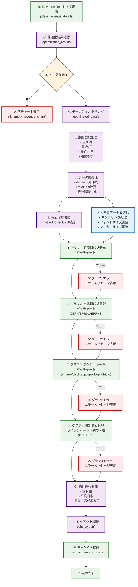
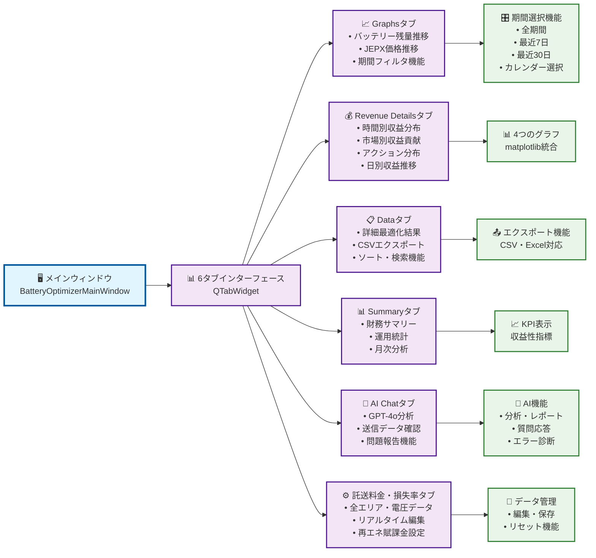
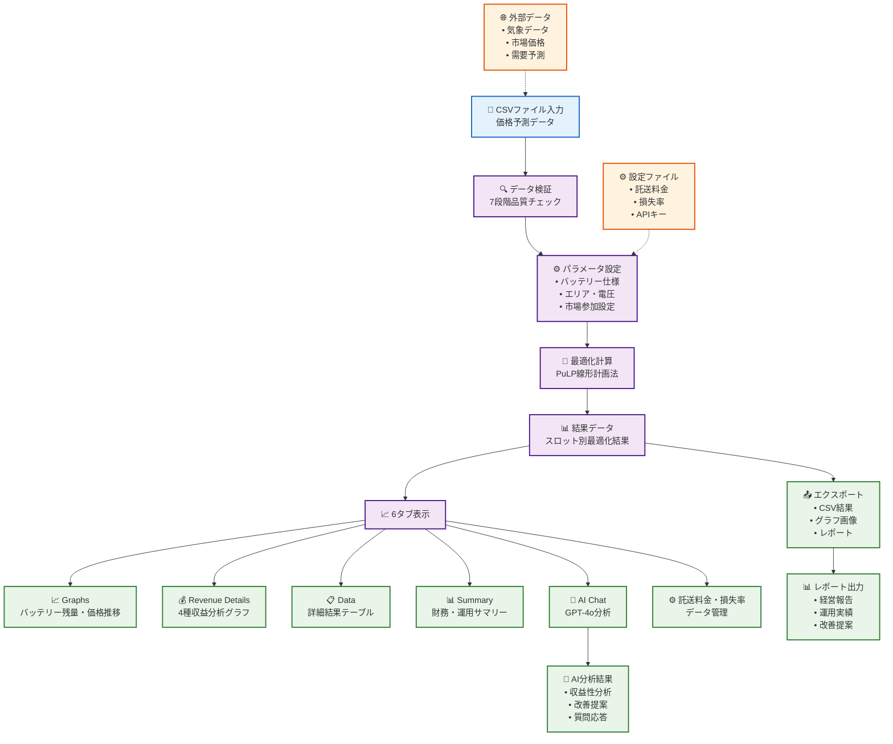

# Battery Optimizer v2.1 - システムフローチャート

このドキュメントには、PyQt6版 Battery Optimizer v2.1の処理フローを視覚化するMermaidフローチャートが含まれています。

## 1. アプリケーション全体フロー

## 2. 最適化エンジン詳細フロー (OptimizationEngine)

```mermaid
flowchart TD
    A["🔄 OptimizationEngine.run()<br/>QThread開始"] --> B["📋 データ検証<br/>_validate_input_data()"]
    
    B --> C["🧹 Step 1: NaN値除去<br/>必須列チェック"]
    C --> D["🔧 Step 2: データ型変換<br/>数値列の正規化"]
    D --> E["🎯 Step 3: スロット検証<br/>1-48範囲チェック"]
    E --> F["📅 Step 4: 日付検証<br/>pandas自動検出"]
    F --> G["📊 Step 5: データ統計<br/>品質レポート生成"]
    
    G --> H{"✅ 検証完了？"}
    
    H -->|"❌"| ERROR["❌ 検証エラー<br/>optimization_failed.emit()"]
    H -->|"✅"| I["🗺️ 託送データ取得<br/>_get_wheeling_data()"]
    
    I --> J["📊 データ前処理<br/>• 日付・スロット順ソート<br/>• 期間計算<br/>• 初期SOC設定"]
    
    J --> K["🔄 日別最適化ループ<br/>_run_battery_optimization()"]
    
    K --> L["📅 Day N データ抽出<br/>forecast_period分"]
    
    L --> M["🔨 PuLP問題構築<br/>_solve_daily_optimization()"]
    
    M --> N["⚙️ 決定変数定義<br/>• 連続変数: charge, discharge<br/>• バイナリ変数: is_charge, is_discharge<br/>• SOC変数: battery_soc"]
    
    N --> O["📋 制約条件設定<br/>• SOC遷移制約<br/>• 排他制約<br/>• 容量制約<br/>• サイクル制限"]
    
    O --> P["🧱 EPRX1制約<br/>（フルモード）"]
    
    P --> Q["🎯 目的関数設定<br/>利益最大化<br/>• JEPX収益<br/>• EPRX1収益<br/>• EPRX3収益"]
    
    Q --> R["⚡ ソルバー実行<br/>• COIN_CMD（優先）<br/>• HiGHS（次点）<br/>• 時間制限なし"]
    
    R --> S{"✅ 最適解発見？"}
    
    S -->|"❌"| T["⚠️ フォールバック<br/>全スロットアイドル"]
    S -->|"✅"| U["📊 解抽出<br/>• Action決定<br/>• SOC計算<br/>• 数値精度処理"]
    
    T --> V["💰 P&L計算<br/>_calculate_slot_pnl()"]
    U --> V
    
    V --> W["📈 結果蓄積<br/>all_transactions.extend()"]
    
    W --> X{"📅 全日完了？"}
    
    X -->|"❌"| L
    X -->|"✅"| Y["📊 サマリー生成<br/>_generate_summary()"]
    
    Y --> Z["📅 月次サマリー<br/>_generate_monthly_summary()"]
    
    Z --> AA["✅ 最適化完了<br/>optimization_completed.emit()"]
    
    %% エラーハンドリング
    R -.->|"ソルバーエラー"| ERROR
    L -.->|"キャンセル"| CANCEL["⏹️ 最適化キャンセル<br/>is_cancelled = True"]
    
    %% スタイル設定
    classDef startEnd fill:#e1f5fe,stroke:#01579b,stroke-width:2px
    classDef process fill:#f3e5f5,stroke:#4a148c,stroke-width:2px
    classDef decision fill:#fff3e0,stroke:#e65100,stroke-width:2px
    classDef error fill:#ffebee,stroke:#c62828,stroke-width:2px
    classDef calc fill:#e8f5e8,stroke:#2e7d32,stroke-width:2px
    
    class A,AA startEnd
    class B,C,D,E,F,G,I,J,K,L,M,N,O,P,Q,R,T,U,V,W,Y,Z process
    class H,S,X decision
    class ERROR,CANCEL error
    class AA calc
```

## 3. AI分析機能フロー (v2.1新機能)

## 4. Revenue Details生成フロー (v2.1新機能)

## 5. 6タブシステム構成

## 6. データフロー概要

このフローチャートは、Battery Optimizer v2.1の最新機能と処理フローを包括的に表現しています。実際の実装と正確に対応しており、AI機能、Revenue Details、6タブ構成などの新機能が反映されています。 