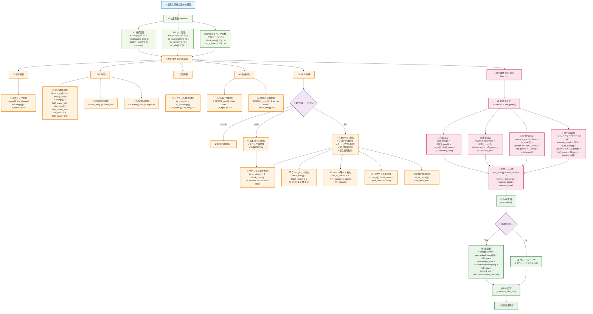

# バッテリー最適化 計算ロジック フローチャート

このドキュメントには、バッテリー最適化システムの計算ロジックを視覚化するMermaidフローチャートが含まれています。

## 1. メイン処理フロー

以下のMermaidコードをコピーして、任意のMermaid対応エディタで編集・表示できます：

```mermaid
flowchart TD
    A["🔄 最適化開始<br/>OptimizationEngine.run()"] --> B{"📋 入力データ検証<br/>_validate_input_data()"}
    
    B -->|"エラー"| ERROR["❌ 最適化失敗<br/>optimization_failed.emit()"]
    B -->|"成功"| C["📍 托送データ取得<br/>_get_wheeling_data()"]
    
    C --> D["🔧 パラメータ設定<br/>• バッテリー容量/出力<br/>• 損失率<br/>• デバッグモード"]
    
    D --> E["📊 データ前処理<br/>• 日付・スロット順ソート<br/>• 日数計算<br/>• 初期SOC設定"]
    
    E --> F["🔄 日別最適化ループ開始<br/>_run_battery_optimization()"]
    
    F --> G["📅 Day N データ抽出<br/>forecast_period分のスロット"]
    
    G --> H["🔨 PuLP最適化問題構築<br/>_solve_daily_optimization()"]
    
    H --> I["⚙️ 決定変数定義"]
    
    I --> J["📈 連続変数<br/>• charge[i]: 充電量<br/>• discharge[i]: 放電量<br/>• battery_soc[i]: SOC"]
    
    J --> K["🔢 バイナリ変数<br/>• is_charge[i]<br/>• is_discharge[i]<br/>• is_eprx3[i]<br/>• is_idle[i]"]
    
    K --> L{"🎯 デバッグモード判定"}
    
    L -->|"simple"| M["🎯 シンプルモード<br/>EPRX1ブロックなし"]
    L -->|"basic"| N["🎯 ベーシックモード<br/>基本EPRX1制約のみ"]
    L -->|"full"| O["🎯 フルモード<br/>全EPRX1制約"]
    
    M --> P["📋 基本制約設定"]
    N --> Q["📋 EPRX1基本制約設定"]
    O --> R["📋 EPRX1フル制約設定"]
    
    P --> S["🎯 シンプル目的関数<br/>JEPX + EPRX3のみ"]
    Q --> T["🎯 EPRX1目的関数<br/>JEPX + EPRX1 + EPRX3"]
    R --> T
    
    S --> U["⚡ 制約条件設定"]
    T --> U
    
    U --> V["🔗 SOC遷移制約<br/>battery_soc[i+1] = battery_soc[i]<br/>+ charge - discharge - eprx3"]
    
    V --> W["🚫 排他制約<br/>各スロットで1つのアクションのみ"]
    
    W --> X["📊 価格データ制約<br/>予測価格が0またはNaNの場合<br/>該当アクション無効化"]
    
    X --> Y["🔧 最適化実行<br/>PuLP.solve()"]
    
    Y --> Z{"✅ 解が見つかったか？"}
    
    Z -->|"No"| AA["⚠️ フォールバック処理<br/>全スロットアイドル"]
    Z -->|"Yes"| BB["📊 最適解から結果抽出"]
    
    AA --> CC["💾 日別結果保存"]
    BB --> DD["🔄 SOC値抽出<br/>pulp.value(battery_soc[i+1])"]
    
    DD --> EE["💰 P&L計算<br/>_calculate_slot_pnl()"]
    
    EE --> FF["📈 スロット別詳細計算<br/>• 充電コスト<br/>• 放電収益<br/>• EPRX収益<br/>• 税込み計算"]
    
    FF --> CC
    
    CC --> GG["🔄 次期SOC更新<br/>carry_over_soc"]
    
    GG --> HH{"📅 全日完了？"}
    
    HH -->|"No"| G
    HH -->|"Yes"| II["📊 全体結果集計"]
    
    II --> JJ["📋 サマリー生成<br/>_generate_summary()"]
    
    JJ --> KK["📈 月次サマリー生成<br/>_generate_monthly_summary()"]
    
    KK --> LL["✅ 最適化完了<br/>optimization_completed.emit()"]
    
    %% エラーハンドリング
    Y -.->|"ソルバーエラー"| ERROR
    G -.->|"キャンセル"| CANCEL["⏹️ 最適化キャンセル<br/>is_cancelled = True"]
    
    %% スタイル設定
    classDef startEnd fill:#e1f5fe,stroke:#01579b,stroke-width:2px
    classDef process fill:#f3e5f5,stroke:#4a148c,stroke-width:2px
    classDef decision fill:#fff3e0,stroke:#e65100,stroke-width:2px
    classDef error fill:#ffebee,stroke:#c62828,stroke-width:2px
    classDef data fill:#e8f5e8,stroke:#2e7d32,stroke-width:2px
    
    class A,LL startEnd
    class B,C,D,E,F,G,H,I,J,K,M,N,O,P,Q,R,S,T,U,V,W,X,Y,BB,CC,DD,EE,FF,GG,II,JJ,KK process
    class L,Z,HH decision
    class ERROR,CANCEL error
    class AA data
```



## 2. 最適化問題の数学的構造



## 3. 主要な計算要素の説明

### 決定変数
- **charge[i]**: スロットiでの充電割合 (0-1)
- **discharge[i]**: スロットiでの放電割合 (0-1)
- **battery_soc[i]**: スロットi終了時のバッテリー蓄電量 (kWh)
- **is_charge[i]**: スロットiで充電を行うかのバイナリ変数
- **is_discharge[i]**: スロットiで放電を行うかのバイナリ変数
- **is_eprx3[i]**: スロットiでEPRX3を行うかのバイナリ変数
- **is_idle[i]**: スロットiでアイドル状態かのバイナリ変数

### 制約条件
1. **SOC遷移制約**: バッテリーの蓄電量の時系列的な変化を表現
2. **排他制約**: 各スロットで1つのアクションのみ実行可能
3. **容量制約**: バッテリーの最大・最小容量制限
4. **価格制約**: 予測価格が無効な場合の動作制限

### 目的関数
各スロットでの利益を合計し、総利益を最大化：
- 充電コスト（JEPX価格 + 托送損失）
- 放電収益（JEPX価格 - バッテリー損失）
- EPRX収益（EPRX1/EPRX3価格 + インバランス収益）

## 4. 編集方法

このファイルのMermaidコードは以下の方法で編集・表示できます：

1. **オンラインエディタ**: https://mermaid.live/ でコードを貼り付け
2. **VS Code**: Mermaid Preview拡張機能をインストール
3. **GitHubのマークダウン**: 直接レンダリング可能
4. **Notion, Obsidian**: Mermaid対応プラグインで表示

## 5. カスタマイズ例

### 色の変更
```mermaid
classDef newStyle fill:#yourcolor,stroke:#yourstroke,stroke-width:2px
class NodeName newStyle
```

### ノードの追加
```mermaid
NewNode["新しい処理"] --> ExistingNode
```

### 接続線の変更
```mermaid
A -.->|"条件付き"| B  %% 点線
A ==>|"太線"| C        %% 太線
``` 